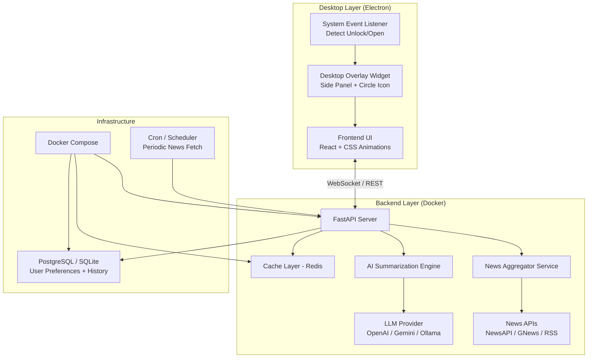
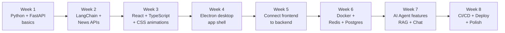

# 🧠 AI News Agent — Desktop Widget Blueprint

> An AI-powered news summarization agent that pins a live news feed to your screen as a desktop overlay widget, minimizable to a floating chatbot icon.

---

## 1. Product Vision

```
┌──────────────────────────────────────────────────────────────┐
│  On laptop open → Agent activates → Fetches latest news     │
│  → AI summarizes → Shows pinned side panel for ~2 min       │
│  → User reads while working → Minimize to circle icon       │
│  → Click icon anytime to expand again                        │
└──────────────────────────────────────────────────────────────┘
```

### Core Features
| Feature | Description |
|---------|-------------|
| **Auto-trigger** | Detects laptop open/unlock → activates agent |
| **AI Summarizer** | Uses LLM to generate concise, categorized news briefs |
| **Pinned Side Panel** | Always-on-top transparent widget (~300px wide) | design needs to be configured for MacOS
| **Minimize to Icon** | Floating draggable circle icon (like a chatbot bubble) | 
| **2-Min Auto-Hide** | Panel auto-minimizes after 2 minutes |
| **Categories** | Tech, World, Finance, Sports — user configurable |
| **Docker Deployment** | Containerized backend, easy to ship anywhere |

---

## 2. High-Level Architecture



---

## 3. Tech Stack Breakdown

### 🖥️ Desktop App (Frontend)

| Layer | Technology | Why |
|-------|-----------|-----|
| **Desktop Framework** | **Electron** | Full JavaScript stack, massive community, proven for desktop widgets, no new language needed |
| **UI Framework** | **React + TypeScript** | Component-based, huge ecosystem, resume gold |
| **Styling** | **CSS Modules + Framer Motion** | Smooth slide-in/out animations, glassmorphism panel |
| **State Management** | **Zustand** | Lightweight, perfect for widget-scale state |
| **Communication** | **WebSocket** | Real-time push updates from backend |

### ⚙️ Backend (API + AI)

| Layer | Technology | Why |
|-------|-----------|-----|
| **API Server** | **FastAPI (Python)** | Async, fast, auto-docs with Swagger, Python ML ecosystem |
| **AI / LLM** | **LangChain + OpenAI API** | Chains for summarization, easy to swap models |
| **Local LLM Option** | **Ollama (Llama 3 / Mistral)** | Run locally, no API costs, privacy-first |
| **News Sources** | **NewsAPI.org + RSS feeds** | Free tier available, broad coverage |
| **Cache** | **Redis** | Cache summaries, avoid redundant API calls |
| **Database** | **PostgreSQL** | User prefs, reading history, bookmarks |
| **Task Queue** | **Celery + Redis** | Background news fetching on schedule |

### 🐳 Infrastructure

| Layer | Technology | Why |
|-------|-----------|-----|
| **Containerization** | **Docker + Docker Compose** | Multi-service orchestration |
| **CI/CD** | **GitHub Actions** | Auto-build, test, push Docker images |
| **Monitoring** | **Prometheus + Grafana** (optional) | Observe API health |

---

## 4. Project Phases (Build Order)

### Phase 1 — Foundation (Week 1-2)
> **Goal**: Get a working backend that fetches and summarizes news

```
✅ Set up Python project with FastAPI
✅ Integrate NewsAPI / GNews for fetching headlines
✅ Build a basic summarization chain with LangChain + OpenAI
✅ Create REST endpoints: GET /news/summary, GET /news/categories
✅ Add Redis caching (don't re-summarize same articles)
✅ Write unit tests with pytest
✅ Dockerize the backend (Dockerfile + docker-compose.yml)
```

**Key deliverable**: `curl localhost:8000/news/summary` returns AI-summarized news

---

### Phase 2 — Desktop Widget Shell (Week 3-4)
> **Goal**: Create the desktop overlay with Electron

```
✅ Initialize Electron app with React frontend
✅ Create the side panel component (300px wide, right-aligned)
✅ Implement always-on-top window with transparency
✅ Build the floating circle icon (minimize state)
✅ Add slide-in/slide-out animations
✅ Implement 2-minute auto-minimize timer
✅ Connect to backend API and display real news
✅ System tray integration (right-click menu)
```

**Key deliverable**: A transparent side panel showing news, auto-hides after 2 min

---

### Phase 3 — System Integration (Week 5)
> **Goal**: Auto-trigger on laptop open + polish UX

```
✅ Detect system unlock/wake events (OS-level hooks)
   - macOS: "unlock" events via Electron powerMonitor API
   - Windows: powerMonitor 'unlock-screen' event
   - Linux: D-Bus / systemd signals
✅ Auto-fetch fresh news on wake
✅ Add user preferences (categories, refresh interval)
✅ Implement reading history / bookmarks
✅ Add "Read More" links to full articles
✅ Dark/Light theme toggle
```

---

### Phase 4 — AI Agent Enhancement (Week 6-7)
> **Goal**: Make it a true "agent" — not just a summarizer

```
✅ Add personalization: learn from what user reads/skips
✅ Implement topic clustering (group related stories)
✅ Add a chat interface in the expanded panel
   - "Tell me more about the Ukraine situation"
   - "What happened in AI this week?"
✅ Add voice briefing option (TTS via browser API)
✅ Implement RAG: store articles in vector DB for Q&A
✅ Add Ollama support for fully local/offline mode
```

---

### Phase 5 — Production & Deployment (Week 8)
> **Goal**: Ship it, Docker deploy, CI/CD

```
✅ Production Docker Compose (backend + Redis + Postgres)
✅ Environment variable management (.env, secrets)
✅ GitHub Actions CI/CD pipeline
✅ Auto-build desktop app binaries (electron-builder)
✅ Write README with architecture diagram
✅ Create demo video / GIF for resume
✅ Deploy backend to cloud (Railway / Fly.io / AWS ECS)
```

---

## 5. What You Need to Learn (Skill Map)

### 🟢 Priority 1 — Core (Must Learn)

| Skill | What to Learn | Resource |
|-------|--------------|----------|
| **Python + FastAPI** | Async endpoints, Pydantic models, dependency injection | [FastAPI Docs](https://fastapi.tiangolo.com/tutorial/) |
| **LangChain** | Chains, prompts, output parsers, memory | [LangChain Docs](https://python.langchain.com/) |
| **OpenAI / Gemini API** | Chat completions, token management, streaming | Official API docs |
| **React + TypeScript** | Hooks, components, state, effects | React docs + TypeScript handbook |
| **Docker** | Dockerfile, docker-compose, volumes, networks | Docker Getting Started guide |
| **REST API Design** | HTTP methods, status codes, request/response patterns | — |
| **WebSockets** | Real-time bidirectional communication | FastAPI WebSocket docs |

### 🟡 Priority 2 — Desktop & System

| Skill | What to Learn | Resource |
|-------|--------------|----------|
| **Electron** | BrowserWindow, Tray, ipcMain/ipcRenderer, powerMonitor | [Electron Docs](https://www.electronjs.org/docs) |
| **CSS Animations** | Transitions, keyframes, glassmorphism, backdrop-filter | MDN Web Docs |
| **OS Event Hooks** | Detecting wake/unlock via Electron's powerMonitor API | Electron docs |

### 🔵 Priority 3 — Data & Infrastructure

| Skill | What to Learn | Resource |
|-------|--------------|----------|
| **Redis** | Caching patterns, TTL, pub/sub | Redis University (free) |
| **PostgreSQL** | Schema design, migrations (Alembic), queries | PostgreSQL Tutorial |
| **Celery** | Task queues, periodic tasks, worker management | Celery docs |
| **GitHub Actions** | CI/CD workflows, matrix builds, artifact uploads | GitHub Actions docs |

### 🟣 Priority 4 — Advanced / Resume Boosters

| Skill | What to Learn | Resource |
|-------|--------------|----------|
| **RAG (Retrieval-Augmented Generation)** | Vector DBs (ChromaDB), embeddings, semantic search | LangChain RAG tutorial |
| **Ollama** | Running local LLMs, model management | [Ollama Docs](https://ollama.com/) |
| **Prompt Engineering** | System prompts, few-shot, chain-of-thought | Anthropic/OpenAI guides |
| **Monitoring** | Prometheus metrics, Grafana dashboards | — |

---

## 6. Key File/Folder Structure

```
hercules-ai/
├── docs/
│   └── BLUEPRINT.md                # This file
├── backend/
│   ├── app/
│   │   ├── main.py                 # FastAPI entry point
│   │   ├── api/
│   │   │   ├── routes/
│   │   │   │   ├── news.py         # News endpoints
│   │   │   │   └── preferences.py  # User settings
│   │   │   └── websocket.py        # WebSocket handler
│   │   ├── services/
│   │   │   ├── news_fetcher.py     # NewsAPI / RSS integration
│   │   │   ├── summarizer.py       # LangChain summarization
│   │   │   ├── agent.py            # AI agent logic
│   │   │   └── cache.py            # Redis cache layer
│   │   ├── models/
│   │   │   ├── schemas.py          # Pydantic models
│   │   │   └── database.py         # SQLAlchemy models
│   │   └── config.py               # Settings & env vars
│   ├── tests/
│   ├── Dockerfile
│   └── requirements.txt
│
├── desktop/
│   ├── src/
│   │   ├── main/
│   │   │   └── main.js             # Electron main process
│   │   ├── renderer/
│   │   │   ├── components/
│   │   │   │   ├── SidePanel.tsx    # Main news panel
│   │   │   │   ├── FloatingIcon.tsx # Minimized circle icon
│   │   │   │   ├── NewsCard.tsx     # Individual news item
│   │   │   │   ├── ChatInterface.tsx# AI chat overlay
│   │   │   │   └── Settings.tsx     # User preferences
│   │   │   ├── hooks/
│   │   │   │   ├── useNewsStream.ts # WebSocket hook
│   │   │   │   └── useSystemEvents.ts # Wake/unlock detection
│   │   │   ├── styles/
│   │   │   │   ├── panel.css        # Side panel styles
│   │   │   │   └── animations.css   # Slide, fade, pulse
│   │   │   ├── App.tsx
│   │   │   └── main.tsx
│   │   └── preload.js              # Electron preload script
│   └── package.json
│
├── docker-compose.yml               # Backend + Redis + Postgres
├── .github/
│   └── workflows/
│       ├── backend-ci.yml
│       └── desktop-build.yml
└── README.md
```

---

## 7. Resume Impact

> **This project checks every box that recruiters and hiring managers look for:**

| Resume Keyword | How This Project Covers It |
|---------------|---------------------------|
| **AI / LLM Integration** | LangChain, OpenAI, prompt engineering, RAG |
| **Full-Stack Development** | React frontend + FastAPI backend |
| **Desktop Application** | Electron, system-level integration |
| **Microservices** | Separate backend services, Docker Compose |
| **Real-Time Systems** | WebSocket communication, live updates |
| **DevOps / CI-CD** | Docker, GitHub Actions, cloud deployment |
| **Database Design** | PostgreSQL schema, Redis caching |
| **System Programming** | OS-level wake detection, always-on-top windows |
| **API Design** | RESTful endpoints, API documentation |

### How to Present It

```
📌 AI News Agent — Desktop Widget
Built an AI-powered desktop overlay that automatically delivers
personalized news summaries upon laptop unlock, using LangChain
for intelligent summarization and Electron for a native desktop
experience. Features real-time WebSocket updates, Redis caching,
and Docker-based microservice deployment.

Tech: Python · FastAPI · LangChain · React · TypeScript · Electron ·
      Docker · Redis · PostgreSQL · WebSocket · GitHub Actions
```

---

## 8. Suggested Learning Path (Order)



---

## 9. Getting Started (First 3 Commands)

```bash
# 1. Scaffold the backend
mkdir -p backend/app && cd backend
python -m venv venv && source venv/bin/activate
pip install fastapi uvicorn langchain openai httpx redis

# 2. Scaffold the desktop app (Electron + React)
npx -y create-electron-app@latest desktop --template=webpack-typescript

# 3. Start Docker services
docker compose up -d redis postgres
```

> **Start with Phase 1 (backend only)**. Get the AI summarization working in a terminal before touching the desktop UI. This keeps complexity manageable and gives you early wins.
